# QA run — oppenheimer — authentication QA

2026-09-13T19:55:42.723Z → 2026-09-13T19:58:09.707Z

**7 passed, 1 failed** across 8 scenarios.

| | Scenario | Severity | Checks | Screenshots |
| --- | --- | --- | --- | --- |
| 🟢 | `AUTH-01` A super admin exists, signs in, and reaches the control plane | critical | 6/6 | 2 |
| 🟢 | `AUTH-02` A member resets a forgotten password and signs in with the new one | critical | 8/8 | 4 |
| 🟢 | `AUTH-03` An invited person joins at the role they were invited as, and lands signed in | critical | 18/18 | 2 |
| 🔴 | `AUTH-04` Bad credentials, bad links and bad input all fail legibly | high | 19/20 | 6 |
| 🟢 | `AUTH-05` A self-service registration is told where it stands | critical | 9/9 | 3 |
| 🟢 | `AUTH-06` An owner of one workspace cannot read another workspace's data | critical | 7/7 | 1 |
| 🟢 | `AUTH-07` Signing out, and resetting a password, close every door they should | high | 10/10 | 3 |
| 🟢 | `AUTH-08` The control plane refuses everyone who is not a platform administrator | critical | 32/32 | 4 |

## 🟢 AUTH-01 — A super admin exists, signs in, and reaches the control plane

*auth · critical · 6686ms*

> the API reports 12 rule(s) for the super admin
> admin-auth-01-superadmin-users: 120px of this screen sat below the fold at 1440×900

- ✅ the seeded super admin can sign in
- ✅ the account carries the superadmin platform role — rendered "superadmin", database says "superadmin"
- ✅ the permission set can be read — HTTP 200
- ✅ the super admin holds unrestricted access, not merely a suggestive role name — rules: manage:Organization, manage:Member, manage:Invitation, manage:Workspace, manage:Role, manage:all, read:ApiToken, create:ApiToken, delete:ApiToken, read:Organization, create:Organization, manage:all
- ✅ the control plane admits the super admin
- ✅ the users endpoint answers the super admin — HTTP 200

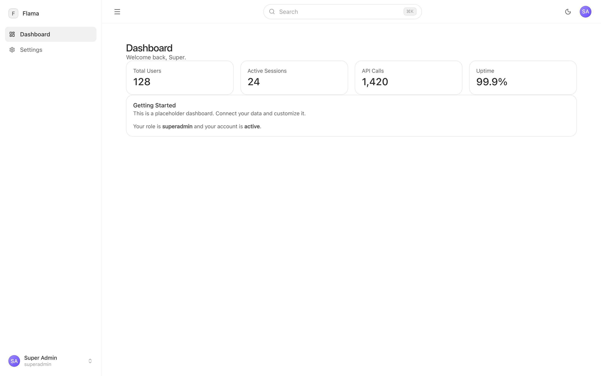

## 🟢 AUTH-02 — A member resets a forgotten password and signs in with the new one

*auth · critical · 47036ms*

> 2 session(s) open before the reset
> the mail sink delivered http://localhost:3001/api/auth/reset-password/KqEJaMM7WDQOHuZkj5oHnZZg?callbackURL=http%3A%2F%2Flocalhost%3A3000%2Freset-password
> 1 session(s) open after the reset

- ✅ the member can be created
- ✅ the request is confirmed without disclosing whether the account exists — Oppenheimer
Check your email

We sent a password reset link to reset.member@qa.oppenheimer.dev. It expires in 30 minutes.

Didn't get it? Check your spam folder, or try another email.

Back to sign in

Only membe
- ✅ the link lands on a form that can set a new password
- ✅ a password below the minimum cannot be submitted — the form states its own rules and keeps submit disabled until they are met
- ✅ the new password signs in
- ✅ the old password no longer signs in
- ✅ the reset link cannot be replayed — Oppenheimer
Invalid link

This reset link is invalid or has expired. Please request a new one.

Request a new link
Back to sign in

Only members of this workspace can reset a password.

Privacy policy
Terms
- ✅ the sessions open before the reset are gone — 2 before, 1 after — a reset exists because the reader believes their credential is compromised

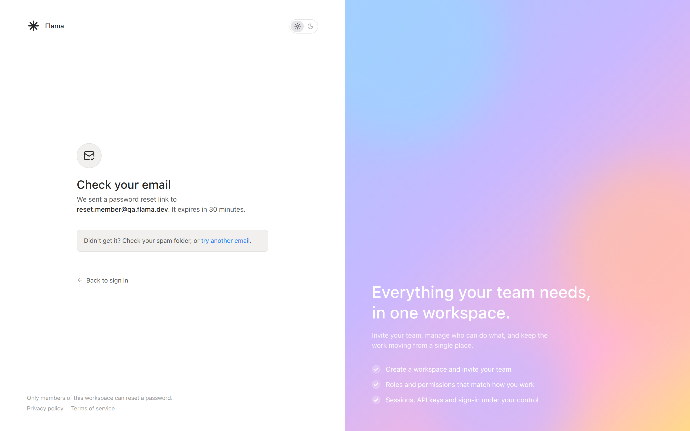

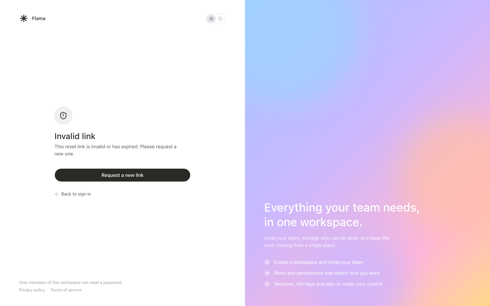

## 🟢 AUTH-03 — An invited person joins at the role they were invited as, and lands signed in

*auth · critical · 13684ms*

> the admin invitee holds membership role "admin" and application role(s) owner, user
> the member invitee holds membership role "member" and application role(s) user, user

- ✅ the workspace owner signs in
- ✅ the owner can invite invitee.admin@qa.oppenheimer.dev as admin — HTTP 201 
- ✅ the owner can invite invitee.member@qa.oppenheimer.dev as member — HTTP 201 
- ✅ both invitations reached the mail sink — 2 link(s)
- ✅ the admin invitee lands signed in on the dashboard rather than on onboarding — http://localhost:3000/dashboard
- ✅ the admin invitee has an account — invitee.admin@qa.oppenheimer.dev
- ✅ the admin invitee joined the inviting workspace
- ✅ the admin invitee's membership role is the one invited — rendered "admin", database says "admin"
- ✅ the admin invitee holds an application role at all — an invitee with no application role can sign in and read nothing
- ✅ the admin invitee can sign in again later
- ✅ the admin invitee still holds the same role on a later sign-in — rendered "admin", database says "admin"
- ✅ the member invitee lands signed in on the dashboard rather than on onboarding — http://localhost:3000/dashboard
- ✅ the member invitee has an account — invitee.member@qa.oppenheimer.dev
- ✅ the member invitee joined the inviting workspace
- ✅ the member invitee's membership role is the one invited — rendered "member", database says "member"
- ✅ the member invitee holds an application role at all — an invitee with no application role can sign in and read nothing
- ✅ the member invitee can sign in again later
- ✅ the member invitee still holds the same role on a later sign-in — rendered "member", database says "member"

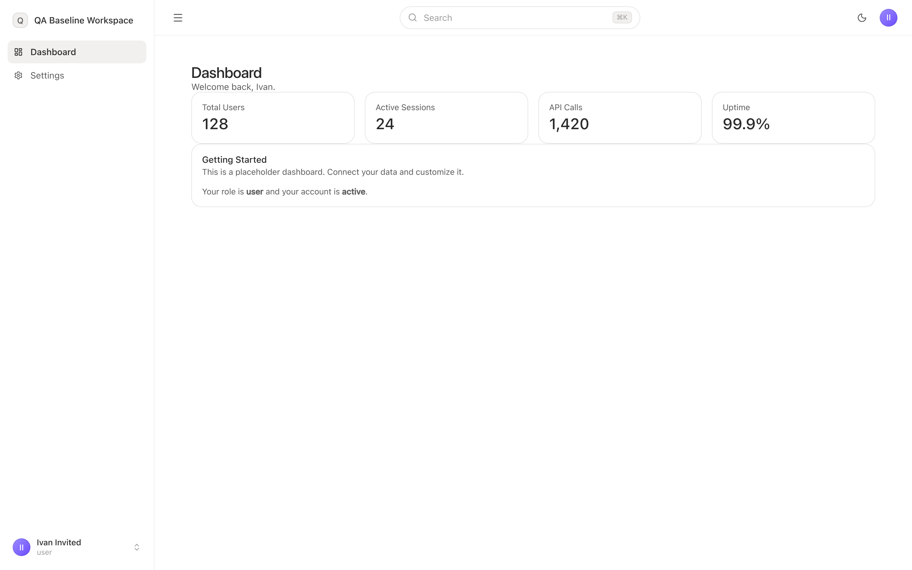

## 🔴 AUTH-04 — Bad credentials, bad links and bad input all fail legibly

*auth · high · 17992ms*

> the account used for the transient cases is reset.member@qa.oppenheimer.dev

- ✅ AUTH-04a: the screen says something legible — reads as prose
- ✅ AUTH-04a: no spinner is left running
- ✅ AUTH-04a: the reader stays on the login screen — http://localhost:3000/login
- ✅ AUTH-04b: the screen says something legible — reads as prose
- ✅ AUTH-04b: no spinner is left running
- ✅ AUTH-04b: an unknown address is refused the same way as a wrong password — wrong password said "Incorrect email or password."; unknown account said "Incorrect email or password."
- ✅ AUTH-04c: a malformed address is stopped before any request
- ✅ AUTH-04c: the screen says something legible — reads as prose
- ✅ AUTH-04c: no spinner is left running
- ✅ AUTH-04d: the screen says something legible — reads as prose
- ✅ AUTH-04d: no spinner is left running
- ❌ AUTH-04d: an unissued reset token reaches the invalid-link state — Oppenheimer
Reset password

Choose a new password for your account

New password
Confirm password
At least 8 characters
Upper & lowercase letters
At least one number
Both passwords match
Reset password

Onl
- ✅ AUTH-04e: the screen says something legible — reads as prose
- ✅ AUTH-04e: no spinner is left running
- ✅ AUTH-04e: an invitation link with no id says so, rather than offering a dead form — This invitation link is incomplete. Ask the workspace owner to send a new invitation.
- ✅ AUTH-04f: a guarded route redirects to the login screen — http://localhost:3000/login?redirect=%2Fdashboard%3Ftab%3Dactivity%26from%3Demail
- ✅ AUTH-04f: the redirect carries the intended destination — redirect="/dashboard?tab=activity&from=email"
- ✅ AUTH-04f: the destination keeps its search params — redirect="/dashboard?tab=activity&from=email"
- ✅ AUTH-04f: the screen says something legible — reads as prose
- ✅ AUTH-04f: no spinner is left running

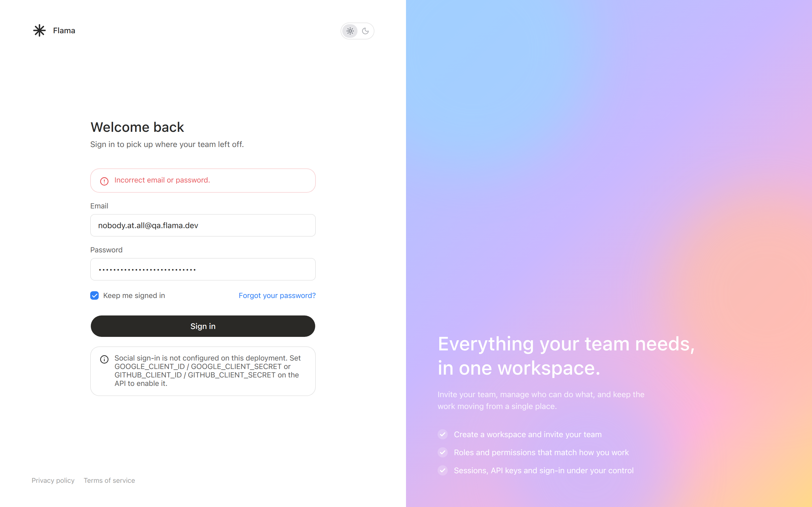

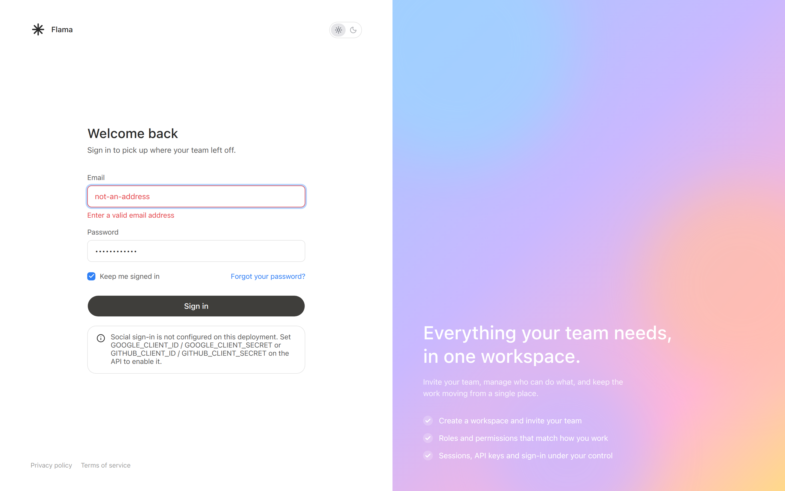

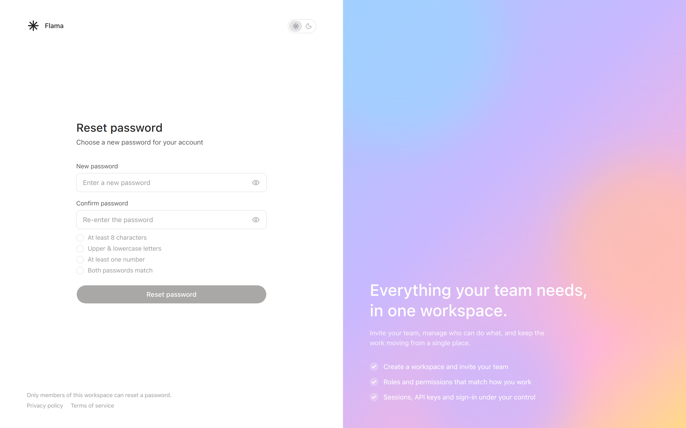

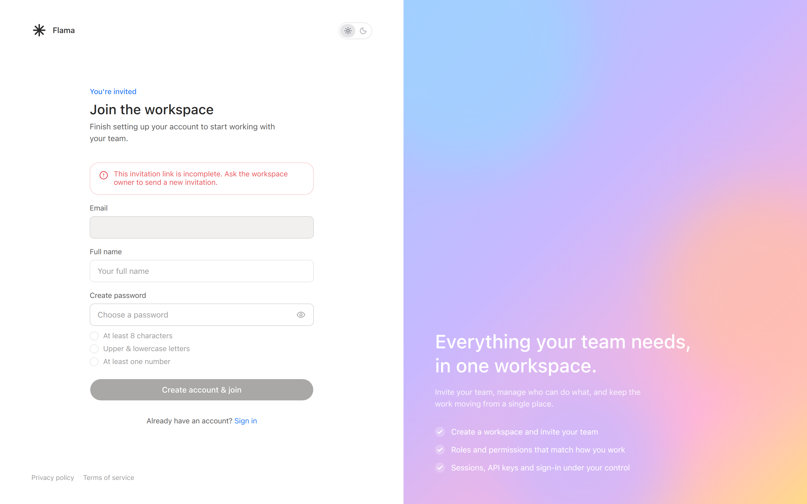

## 🟢 AUTH-05 — A self-service registration is told where it stands

*auth · critical · 12314ms*

> registering landed on /onboarding
> the new account holds 0 membership(s) and the application role(s) user

- ✅ registering signs the account in rather than returning it to the login screen — /onboarding
- ✅ the account exists in the database — newcomer@qa.oppenheimer.dev
- ✅ the screen and the database agree about whether a workspace exists — landed on /onboarding with 0 membership(s) — CLAUDE.md says sign-up creates an account, not a workspace, and an org-less account is sent to /onboarding
- ✅ a self-service registration is sent to onboarding, not to a refusal — /onboarding
- ✅ the first screen says where the reader stands rather than refusing them — Oppenheimer

Almost there

Create your workspace

Your account is ready. Create a workspace for your team, or join one you have been invited to.

Workspace name

You can rename it later from Settings.

Crea
- ✅ onboarding refuses an empty workspace name before asking the server
- ✅ the first workspace lands the newcomer on the dashboard — http://localhost:3000/dashboard
- ✅ the newcomer can sign in again
- ✅ the second sign-in skips onboarding, because the workspace already exists — http://localhost:3000/dashboard

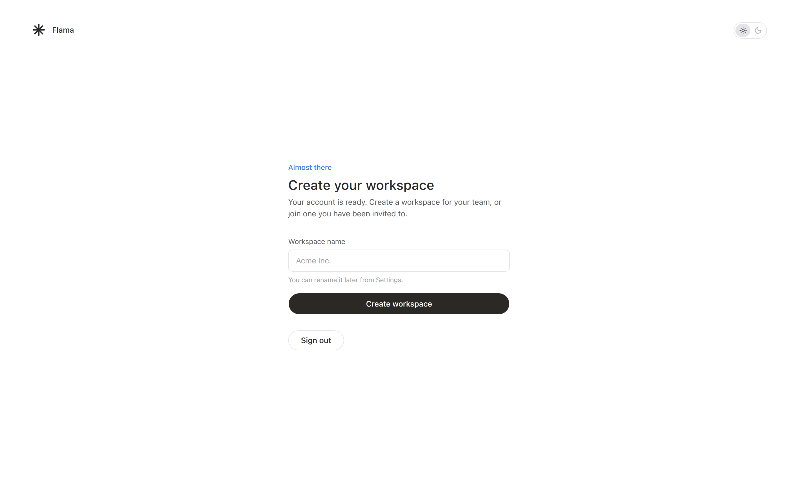

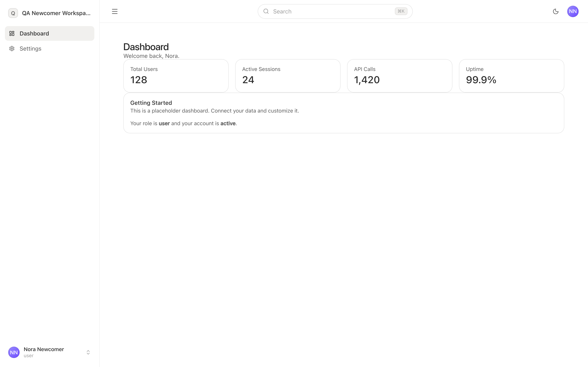

## 🟢 AUTH-06 — An owner of one workspace cannot read another workspace's data

*auth · critical · 3382ms*

> the reader's workspace holds 1 members and 0 teams; the other holds 2000 members and 60 teams
> the members endpoint returned 1 row(s)

- ✅ the reader is a tenant owner and not a platform administrator — rendered "user", database says "user"
- ✅ the two tenants are different enough that a leak would be unmistakable — 1 vs 2000
- ✅ the reader signs in
- ✅ the reader can list their own members — HTTP 200
- ✅ the members endpoint returns the reader's workspace, not the union of both — 1 returned, the workspace holds 1
- ✅ another workspace's members are refused, not returned — HTTP 403
- ✅ another workspace's invitations are refused, not returned — HTTP 403

## 🟢 AUTH-07 — Signing out, and resetting a password, close every door they should

*auth · high · 19844ms*

> 3 session row(s) after signing in on two devices
> the other device is at http://localhost:3000/onboarding after the first signed out
> the mail sink delivered http://localhost:3001/api/auth/reset-password/U3ATFkf6rMhr9ow4VlFugFuh?callbackURL=http%3A%2F%2Flocalhost%3A3000%2Freset-password
> 0 session row(s) after the reset

- ✅ the member can be created
- ✅ the first device signs in
- ✅ the second device signs in
- ✅ each sign-in issued its own session — 3 session(s)
- ✅ a session cookie was set — better-auth.session_token
- ✅ the session cookie is httpOnly, so a script on the page cannot read it — httpOnly=true
- ✅ signing out removes the session row, not only the cookie — 3 before, 2 after
- ✅ the signed-out device can no longer open the dashboard — http://localhost:3000/login?redirect=%2Fdashboard
- ✅ signing out on one device leaves the other's own session alone — http://localhost:3000/onboarding
- ✅ a password reset signs the other device out too — http://localhost:3000/login?redirect=%2Fdashboard — the device the reader no longer trusts must lose its session

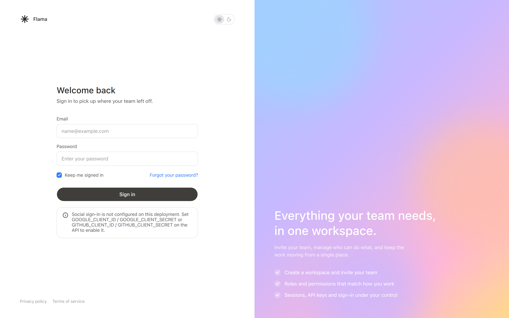

## 🟢 AUTH-08 — The control plane refuses everyone who is not a platform administrator

*auth · critical · 21744ms*

> admin-auth-08-platform-admin: 120px of this screen sat below the fold at 1440×900

- ✅ the owner can authenticate at all — http://localhost:3003/users
- ✅ the control plane gives the owner an answer, not a breakage — reads as prose
- ✅ the control plane admits the owner only if they are a platform administrator — rendered false, database says false
- ✅ the owner is told they are refused, rather than shown a blank shell — Control plane access requiredThis workspace is reserved for platform administrators.Log out
- ✅ the owner's refusal is not a spinner
- ✅ the owner is not bounced back to the login form, which reads as a wrong password — http://localhost:3003/users
- ✅ the users endpoint refuses the owner with 401 or 403, not a 500 — HTTP 403
- ✅ the refusal of the owner is an RFC 7807 problem document — application/problem+json; charset=utf-8
- ✅ the consumer app still admits the owner — http://localhost:3000/dashboard
- ✅ the admin can authenticate at all — http://localhost:3003/users
- ✅ the control plane gives the admin an answer, not a breakage — reads as prose
- ✅ the control plane admits the admin only if they are a platform administrator — rendered false, database says false
- ✅ the admin is told they are refused, rather than shown a blank shell — Control plane access requiredThis workspace is reserved for platform administrators.Log out
- ✅ the admin's refusal is not a spinner
- ✅ the admin is not bounced back to the login form, which reads as a wrong password — http://localhost:3003/users
- ✅ the users endpoint refuses the admin with 401 or 403, not a 500 — HTTP 403
- ✅ the refusal of the admin is an RFC 7807 problem document — application/problem+json; charset=utf-8
- ✅ the consumer app still admits the admin — http://localhost:3000/dashboard
- ✅ the plain-member can authenticate at all — http://localhost:3003/users
- ✅ the control plane gives the plain-member an answer, not a breakage — reads as prose
- ✅ the control plane admits the plain-member only if they are a platform administrator — rendered false, database says false
- ✅ the plain-member is told they are refused, rather than shown a blank shell — Control plane access requiredThis workspace is reserved for platform administrators.Log out
- ✅ the plain-member's refusal is not a spinner
- ✅ the plain-member is not bounced back to the login form, which reads as a wrong password — http://localhost:3003/users
- ✅ the users endpoint refuses the plain-member with 401 or 403, not a 500 — HTTP 403
- ✅ the refusal of the plain-member is an RFC 7807 problem document — application/problem+json; charset=utf-8
- ✅ the consumer app still admits the plain-member — http://localhost:3000/dashboard
- ✅ the platform-admin can authenticate at all — http://localhost:3003/users
- ✅ the control plane gives the platform-admin an answer, not a breakage — reads as prose
- ✅ the control plane admits the platform-admin only if they are a platform administrator — rendered true, database says true
- ✅ the users endpoint answers the platform-admin — HTTP 200
- ✅ the consumer app still admits the platform-admin — http://localhost:3000/dashboard

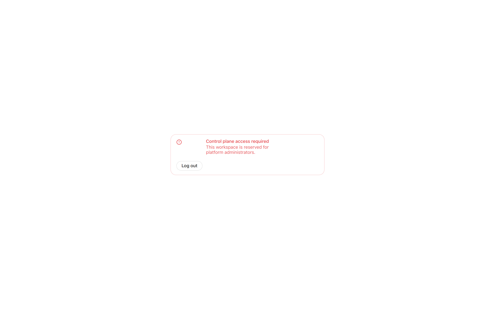

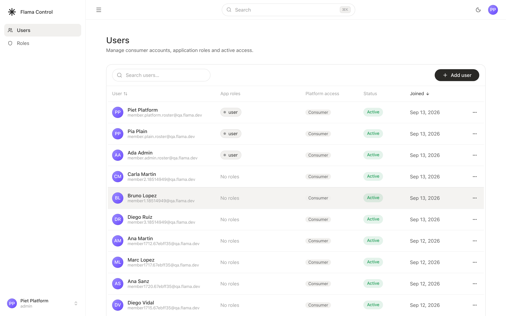
